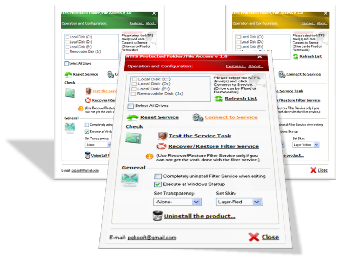

## NTFS Protected Folder/File Access v 1\.0

### Description

NTFS Protected Folder/File Access is a useful and powerful tool, which provides you the access to any NTFS Protected Folder/File on your drives without resetting the permission of them. This is basically accomplished by using a File System Filter Driver, which deals with NTFS and the tool can be used,

• to instantly access any drive(s), which you get the message 'Access is denied' because of NTFS permission.

• to access folders/files when you mess up with NTFS permission of a drive.

• when you cannot take the ownership of folders/files on a drive to use them, because the drive is read only

(Eg: read-only hard drive.) or mounted as read-only.

• when considering the time which takes to gain the ownership of millions of files of a drive in order to use them.

• to temporarily access folders/files which you cannot access or modify because of the guard provided by some of

the security products on the market.

• to access the files which seem to have been corrupted because of NTFS permission.

• to access the NTFS protected data on NTFS-formatted removable drives as well.

• to access the NTFS protected Drives/Folders/Files, when you can not reset to access them because Security Tab is missing on properties and you can't get it reset

due to Folder Options/Use simple file sharing is restricted or missing.
 
### More Info
 

             |
---                |---
**Submitted On**   |2011-07-23 02:34:02
**By**             |[P\. G\. B\. Prasanna](https://github.com/Planet-Source-Code/PSCIndex/blob/master/ByAuthor/p-g-b-prasanna.md)
**Level**          |Intermediate
**User Rating**    |5.0 (25 globes from 5 users)
**Compatibility**  |VB 6\.0
**Category**       |[Complete Applications](https://github.com/Planet-Source-Code/PSCIndex/blob/master/ByCategory/complete-applications__1-27.md)
**World**          |[Visual Basic](https://github.com/Planet-Source-Code/PSCIndex/blob/master/ByWorld/visual-basic.md)
**Archive File**   |[NTFS\_Prote2208527232011\.zip](https://github.com/Planet-Source-Code/p-g-b-prasanna-ntfs-protected-folder-file-access-v-1-0__1-74018/archive/master.zip)

